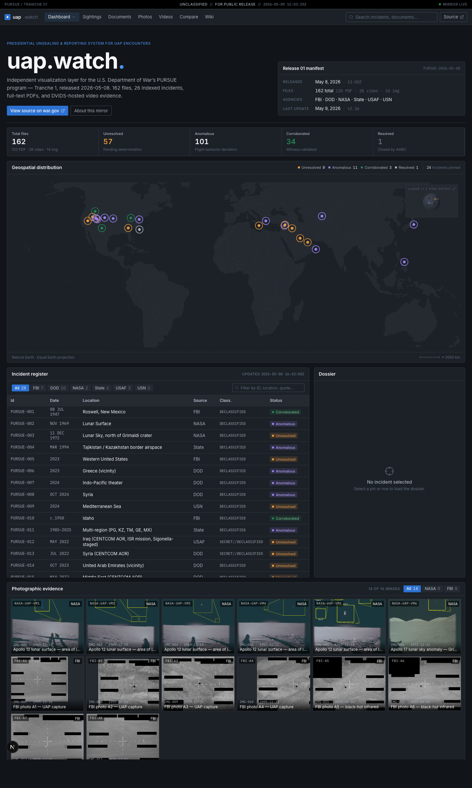
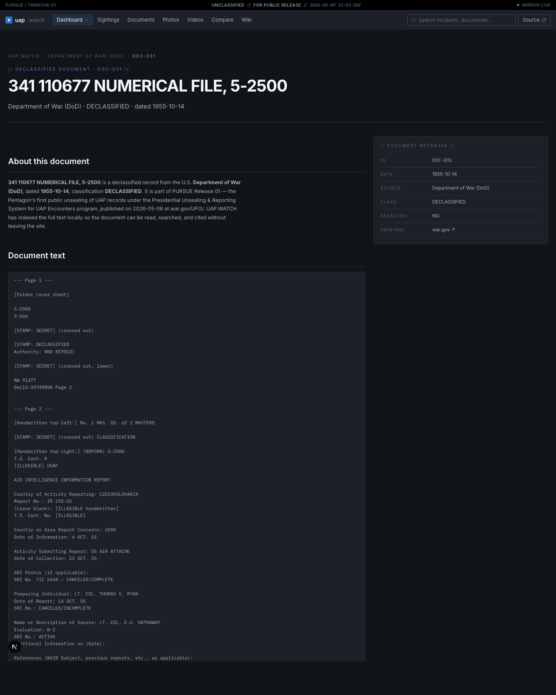
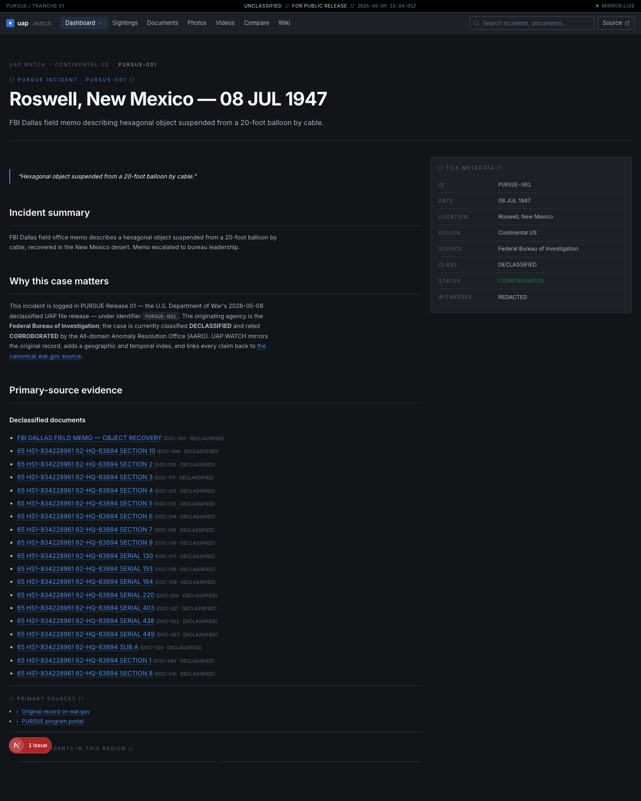

# uap.watch

> Independent visualization layer for the U.S. Department of War's PURSUE program — Tranche 1, released 2026-05-08. 162 declassified UFO/UAP files, 57 indexed incidents, full-text PDFs, and OV/IO-hosted video evidence.

🔗 **Live:** [uap-watch-flame.vercel.app](https://uap-watch-flame.vercel.app)

---



## What this is

A public, fully-indexed reading room for the PURSUE Release 01 declassified files. The official war.gov drop is a flat directory of PDFs and form scans; uap.watch turns it into a navigable archive — every document OCR'd to clean text, every incident geolocated, every photographic and video exhibit cross-linked to its primary source.

**What you can do:**

- Browse 162 declassified documents with full extracted text — including FBI memos, Air Force intelligence reports, Navy Range Fouler debriefs, NASA Apollo transcripts, and State Department cables.
- Inspect 57 PURSUE incidents on a world map, filtered by year, region, or originating agency (FBI, DOD, NASA, USAF, USN, State).
- Read the original photographic and video evidence with deep-link references back to the war.gov source.
- Cross-reference cases via wiki entries, FAQ explainers, state-by-state breakdowns, and side-by-side comparisons.

## Screenshots

### Document viewer — full text indexing
Every PDF is OCR'd, vision-cleaned where needed, and rendered with declassification metadata in-line.



### Incident detail — primary-source evidence
Each incident page links to the underlying declassified documents, photo evidence, and video exhibits with full provenance.



## Tech stack

- **[Next.js 16](https://nextjs.org)** App Router + React Server Components
- **TypeScript** end-to-end
- **[Tailwind CSS v4](https://tailwindcss.com)** with `@theme` tokens
- Palantir Foundry-inspired dark UI palette (Blueprint dark theme tokens)
- **PDF/OCR pipeline:** `pdftotext`, `ocrmypdf`, Tesseract, with a vision-based fallback (Claude) for the few documents Tesseract can't crack
- **JSON-LD structured data** (NewsArticle, FAQPage, Article, BreadcrumbList) for every page
- **IndexNow** auto-ping on every Vercel production deploy
- **`llms.txt` / `llms-full.txt`** generated at build time for LLM-friendly content discovery
- Deployed on **[Vercel](https://vercel.com)**

## Local development

```bash
npm install
npm run dev
```

Open [http://localhost:3000](http://localhost:3000).

## Data pipeline

The archive is built from `data/documents.ts`, `data/incidents.ts`, and `data/videos.ts`. Document text is extracted via:

```bash
# All docs (idempotent — skips already-indexed)
node scripts/index-pdfs.mjs --all

# Specific docs
node scripts/index-pdfs.mjs --sample DOC-009,DOC-039

# Force re-extract with stricter OCR flags
node scripts/index-pdfs.mjs --sample DOC-031 --re-extract

# When Akamai 403s the IP, fall back to Wayback
node scripts/download-missing.mjs
```

Extraction outputs:
- `public/extracted/<DOC-ID>.txt` — committed plain text, served at runtime
- `data/extracted/<DOC-ID>.json` — gitignored sidecar metadata

## Sources & acknowledgements

- Primary source: [war.gov/medialink/ufo/release_1](https://www.war.gov/medialink/ufo/release_1) (Department of War PURSUE Release 01, 2026-05-08)
- Wayback Machine mirror used as a fallback when the war.gov CDN rate-limits
- Built independently of the U.S. Department of War; this is a public-interest visualization of files the Department itself released

## License

MIT for the code. The underlying documents are U.S. government works in the public domain.
